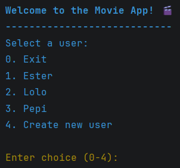
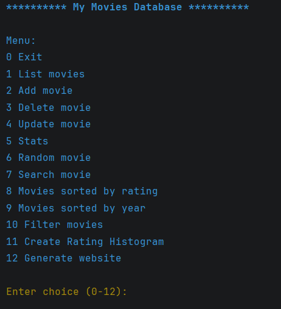
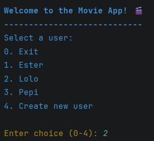
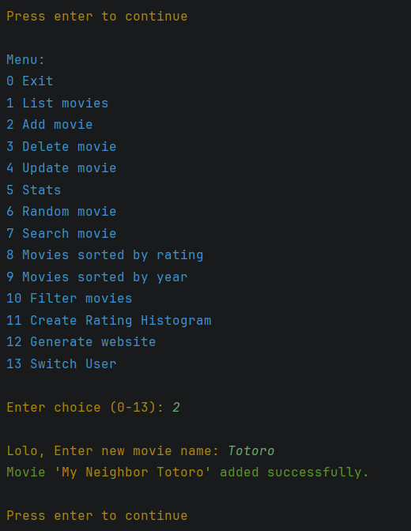
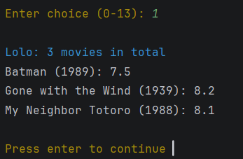
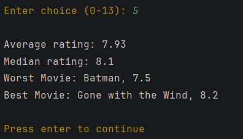
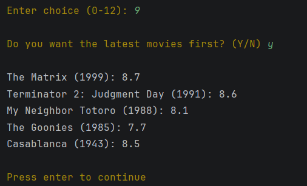
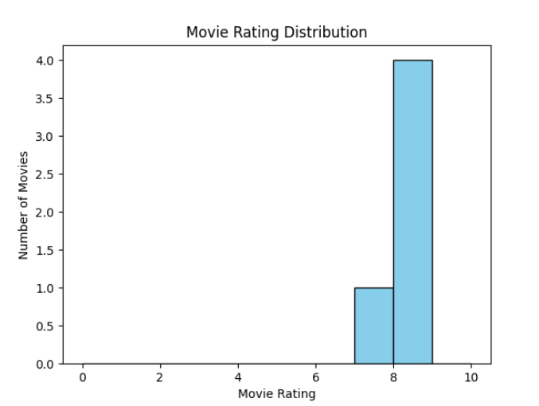
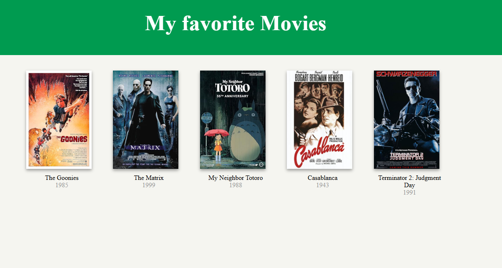

# **My favorite Movies**

---

A command-line movie management application built with Python.

## **Description**

___

This project was developed as a practice assessment for a Software Engineering Bootcamp in Masterschool.
It demonstrates:

- the integration of external APis
- database management
- data visualization
- static website generation

## **Overview**

"My favorite Movies" allows users to build and manage a personal movie collection. Movie information is retrieved form the IMBD database through the OMDb API and stored locally in an SQLite database.

The application provides tools for browsing, searching, analyzing and visualizing movie data, as well as generating a static HTML website containing the movie collection.

## **Features**

___

### User Management

- Create new users of the database
- Each user have independent collections in the database

### Movie Management

- View all movies in the database
- Add new movies from IMDb website
- Update movie information
- Delete movies
- Search for movies by title

### Data Analysis

- Display movie statistics
- Sort movies by rating
- Sort movies by release year
- Filter movies using custom criteria
- Get a random movie recommendation

### Visualization

- Generate rating histograms using Matplotlib
- Analyze rating distributions visually

### Website Generation

- Generate a static HTML website containing the movie collection
- Share movie information through a browser-friendly interface

## Technologies Used

___

| Technology | Purpose                                  |
|:-----------|:-----------------------------------------|
| Python     | Core application                         |
| SQLite     | Local database storage                   |
| SQLAlchemy | Database management                      |
| Matplotlib | Data visualization, histogram generation |
| Colorama   | Colored terminal output                  |
| HTML       | Generated movie website                  |

## **How It Works** ##

___

1. Select a user or create a new one.
2. The user searches for a movie.
3. The application retrieves movie information (release year, rating and poster url) through the OMDb API.
4. The movie data is stored in a local SQLite database.
5. The user can manage and analyze their collection through the command-line interface.
6. The application can generate a rating chart and a static website from the stored data.

## **Installation**

___

1. Get a free API Key at https://www.omdbapi.com/
2. Clone the repository:

```
git clone https://github.com/esterplaza/Movie-Project.git
```

3. Install requirements:

```
pip install -r requirements.txt
```

4. Enter your API KEY.

This project requires an API key to access the animal data service.

Create a .env file in the project root directory:

```
API_KEY="your_api_key_here"
```

Replace your_api_key_here with your own API key.

The .env file is not included in the repository for security reasons.

5. Change git remote url to avoid accidental pushes to base project

```
   git remote set-url origin github_username/repo_name
   git remote -v # confirm the changes
```

### Required Packages

```
pip install sqlalchemy requests matplotlib colorama
```

## External Services

___

This project retrieves movie information using the OMDb API.

API website: https://www.omdbapi.com/

Movie data is fetched when adding new movies and then stored locally in an SQLite database.

## **Running the Application**

___

Start the program:

```
python main.py
```

Example main menu:



Example database management menu:



## **Database Design**

___

Movies are stored locally using SQLite. The database contains information such as:

- Movie title
- Release year
- IMDb rating
- Poster URL

## **Usage**

___

### Example Workflow

1. Select a User:



2. Add a movie by title.



3. List the movies in the database.



4. Generate statistics:



5. Display movies sorted by year.



6. Crate a rating Histogram.



7. Export the collection as a static HTML website.



## Acknowledgments

___

- Movie data provided by the OMDb API.
- Built using SQLAlchemy, Requests, Matplotlib, and Colorama.

## **Contact**

___

Ester Plaza Fernández - esterplaza@gmail.com

Project Link: https://github.com/esterplaza/Movie-Project.git

